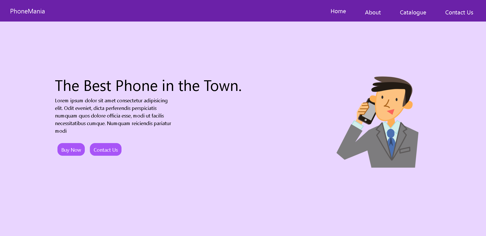
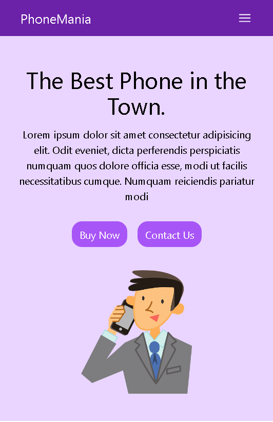

# Best Phone Hero Section - Tailwind CSS Project

## Table of contents

- [Overview](#overview)
  - [Screenshot](#screenshot)
  - [Links](#links)
- [My process](#my-process)
  - [Built with](#built-with)
  - [What I learned](#what-i-learned)
  - [Continued development](#continued-development)
- [Author](#author)
- [Acknowledgments](#acknowledgments)

## Overview

This is a Best Phone Hero section built using Tailwind CSS. The website features a simple and clean design for a phone store landing page, highlighting the main product and a call-to-action for purchasing and contacting. The project implements a responsive navigation menu that adapts for different screen sizes.

### Screenshot

- **Best Phone Hero Section : Desktop design**

- **Best Phone Hero Section : Mobile design**

### Links

- Solution URL: [https://github.com/hoor23/Hero_Section.git](https://github.com/hoor23/Hero_Section.git)
- Live Site URL: [https://hoor23.github.io/Hero_Section/](https://hoor23.github.io/Hero_Section/)

## My process

### Built with

- **HTML5** : For structuring the content.
- **Tailwind CSS** : For styling and creating responsive designs.
- **JavaScript** : Used to implement the mobile menu functionality.

### What I learned

- Tailwind CSS helped streamline the styling process, allowing for rapid prototyping and design.
- I learned to handle responsive design using Tailwind's utility classes like md:flex, hidden, and flex.
- Implemented a mobile menu using a simple JavaScript toggle for hiding and showing the navigation bar.
- Gained experience in combining Tailwind's grid/flex utilities to build responsive layouts quickly.

### Continued development

- Further improvements can be made to optimize accessibility (ARIA attributes) and improve SEO.
- Adding animations to the elements for a better user experience.
- Expanding the functionality of the website with more interactive components like modals and forms.

## Author
- Frontend Mentor - [hoor23](https://www.frontendmentor.io/profile/hoor23)
- Github - [hoor23](https://github.com/hoor23)
- LinkedIn - [Hoor Seyda](www.linkedin.com/in/hoor-seyda-901176222)

## Acknowledgments

- Special thanks to the Tailwind CSS documentation for providing comprehensive examples and guidance.

- Any online tutorials that helped in understanding Tailwind CSS and responsive web design.
